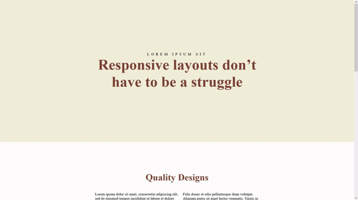

<!-- PROJECT LOGO -->
 

  

  <h3 align="center">Conquering Responsive Layouts Challenges</h3>

  

    This are the challenges of the course Conquering Responsive Layouts Challenges by the professor Kevin Powell
     
     
  

<!-- TABLE OF CONTENTS -->

  
Table of Contents

  <ol>
    <li><a href="#prerequisites">Prerequisites</a></li>
    <li><a href="#running">Running</a></li>
    <li><a href="#contact">Contact</a></li>
  </ol>

<!-- ABOUT THE PROJECT -->
## About The Project

Here are the images of all the completed challenges:

  Challenge 01 - Replic what was shown
  

  Challenge 02 - Replic what was shown
  

  Challenge 03 - Replic the PDF file
  

  Challenge 04 - Do the PDF sections
  

  Challenge 05 - Do the Second section of the site
  

  Challenge 06 - Navbar
  

  Challenge 07 - Duplicating site from PDF from scratch
  

For more details on the challenges you can access the folder "Challenges as they were displayed", where I posted all challenges as the were passed down to me

The full course can be found at https://courses.kevinpowell.co/

## Prerequisites
  * VSC (Visual Studio Code)
  * Live Server Extension

## Running

Run VSC (Visual Studio Code) on the page of the challenge desired, install the extension Live Server in VSC and run it, the code should open now in your Browser.

## Contact

My Name: André Lusegardis Miranda de Oliveira

  * lusegardis@gmail.com

  * [LinkedIn](https://www.linkedin.com/in/andr%C3%A9-lusegardis/)

  * [GitHub](https://github.com/MestreALMO)
